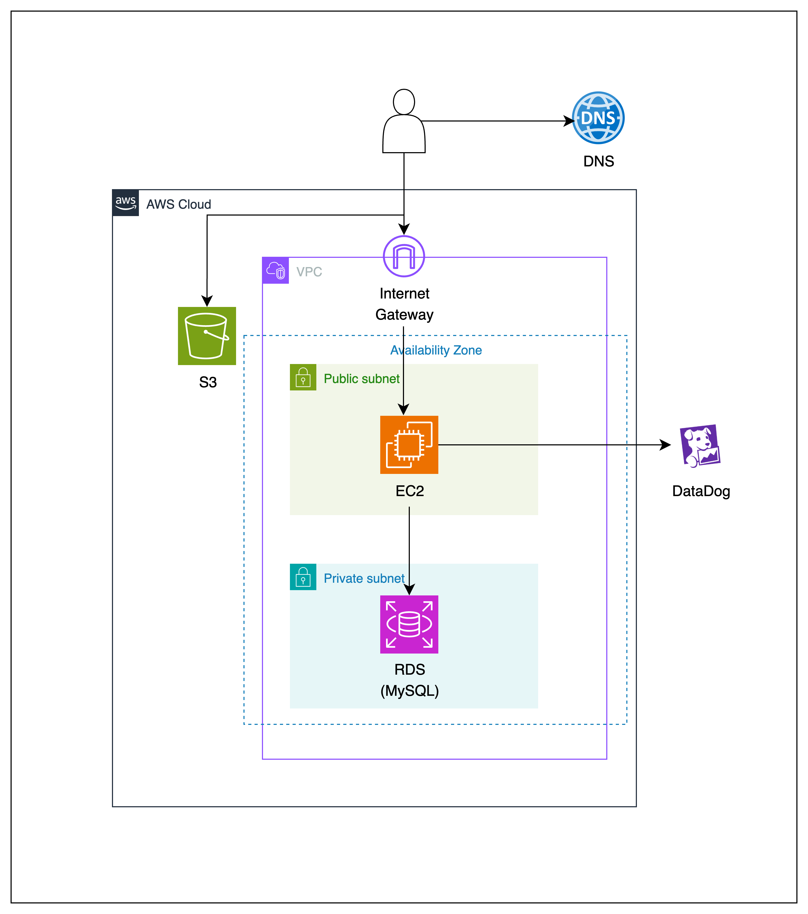

# Debate Timer Backend

## 프로젝트 소개

디베이트 타이머는 더 쉬운 토론 진행을 위한, 오직 토론을 위한 타이머입니다.

## 기술 스택

### Backend

<div>


</div>

### Database

<div>


</div>

### DevOps & Monitoring

<div>


</div>

### Documentation & Testing

<div>


</div>

## 프로젝트 구조

```
src/
├── main/
│   ├── java/com/debatetimer/
│   │   ├── aop/               # AOP 및 로깅 관련
│   │   ├── client/            # 외부 API 클라이언트
│   │   ├── config/            # 설정 클래스
│   │   ├── controller/        # REST API 컨트롤러
│   │   │   ├── auth/          # 인증 관련
│   │   │   ├── customize/     # 토론 테이블 커스터마이징
│   │   │   ├── member/        # 회원 관리
│   │   │   └── poll/          # 투표 관리
│   │   ├── domain/            # 도메인 모델
│   │   ├── domainrepository/  # 도메인 레포지토리
│   │   ├── dto/               # 데이터 전송 객체
│   │   ├── entity/            # JPA 엔티티
│   │   ├── exception/         # 예외 처리
│   │   ├── repository/        # JPA 레포지토리
│   │   └── service/           # 비즈니스 로직
│   └── resources/
│       ├── application*.yml   # 환경별 설정
│       ├── logging/           # 로깅 설정
│       └── db/migration/      # Flyway 마이그레이션
└── test/                      # 테스트 코드
```

## Infra & Deployment



## BE 팀원 소개

|  |  |  |
|:-------------------------------------------------------------------------------------------:|:------------------------------------------------------------------------------------------:|:-------------------------------------------------------------------------------------------:|
|                            [콜리](https://github.com/coli-geonwoo)                            |                            [커찬](https://github.com/leegwichan)                             |                             [비토](https://github.com/unifolio0)                              |
